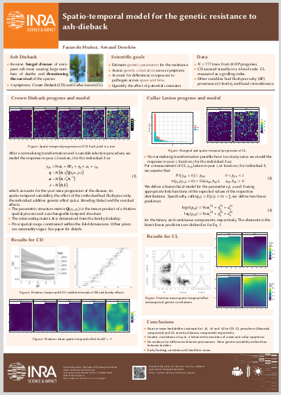

# RisingAshes

Data and code to the to reproduce the results in [Muñoz et al. 
(2016)](http://dx.doi.org/10.1094/PHYTO-11-15-0284-R) [1], which analyzes the
genetic variation in susceptibility to a pathogen using a spatio-temporal
hierarchical Bayesian model implemented with [INLA](http://www.r-inla.org/).

This package contains three vignettes with all the code necessary to reproduce
the results from the paper (and more results that did not make it to the paper).

You can use this repository in one of several ways:

1. **Installation free**

    You can peek at the code online here. The code for fitting the models and 
    producing all results is within [vignettes/](vignettes). Note that the
    vignettes use some helper functions from a separate [file](R/helpers.R)


2. **Light-weight installation**

    To browse offline or to explore the data yourself, install the package 
    locally as follows. This will also install a number of additional packages
    for data manipulation and plotting.

    ```r 
    if(!require(devtools)) install.packages('devtools')
    devtools:::install_github('famuvie/2016_RisingAshes')
    ```
    
    ```r
    library(RisingAshes)
    browseVignettes('RisingAshes')  # vignettes
    str(Devecey)                    # data
    ```

3. **Medium-weight installation**

    To reproduce the vignettes or to explore the results, download the cached 
    results file (184 Mb file) and then reload the package

    ```r
    if(!require(httr)) install.packages('httr')
    url <- "https://github.com/famuvie/2016_RisingAshes/releases/download/V1.0/sysdata.rda"
    tmp <- httr::GET(url,httr::write_disk(tempfile()), httr::progress("down"))
    instdir <- system.file(package = 'RisingAshes')
    tools:::sysdata2LazyLoadDB(tmp$content, file.path(instdir, "R"), compress = 3L)
    detach(package:RisingAshes, unload=TRUE)
    library(RisingAshes)
    ```

    Since the computations can take several hours, all the expensive results are
    lazy-loaded with the package, so that you can explore the results without
    the need of recomputing everything. The code for producing the results is
    included in the vignettes, but is not executed by default at compilation 
    time.
  
4. **Full installation**

    If you want to fit the models and fully reproducing the results for yourself, 
    install `INLA` with:

    ```r
    install.packages('INLA', repos = 'http://www.math.ntnu.no/inla/R/testing')
    ```
    
    For refitting the models you might want to setup the computation on a
    server.


You can also download a poster for a summary of the article:

[](http://prodinra.inra.fr/ft?id={A660AB0A-ADAB-4403-954D-38D91BE255AB})

[1] **Muñoz, F., Marçais, B., Dufour, J., and Dowkiw, A. 2016**. Rising Out of 
the Ashes: Additive Genetic Variation for Crown and Collar Resistance to 
Hymenoscyphus fraxineus in Fraxinus excelsior. *Phytopathology* 106:1-10. DOI: 
[10.1094/PHYTO-11-15-0284-R](http://dx.doi.org/10.1094/PHYTO-11-15-0284-R). A
preprint is available at [bioRXiv](http://dx.doi.org/10.1101/031393).
